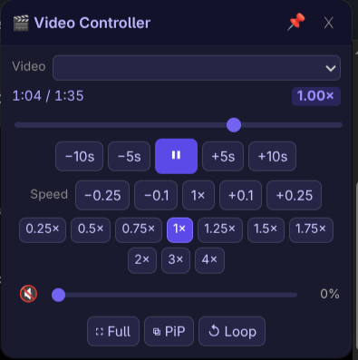
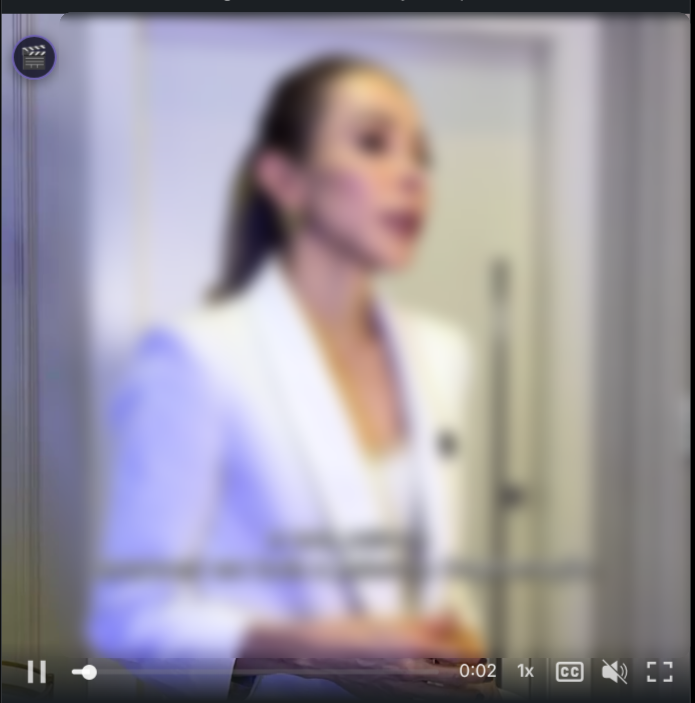
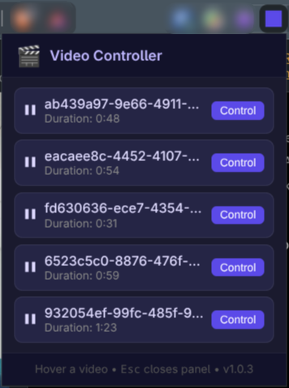

# 🎬 Video Controller

> Take control of **any `<video>` element** on any page — including players that deliberately hide speed controls, block seeking, or reset your playback rate.


<!-- Screenshot: floating controller panel over a video -->
<p align="center">
  
</p>

## Why?

Many course platforms, corporate LMSs and streaming sites **hide the speed control** or **disable the seek bar** on purpose. Video Controller gives them back:

- A floating mini-player with every control the browser natively supports.
- Works on videos buried inside **iframes** (most embedded players).
- Actively **defends your chosen speed** when the site tries to reset it.

## Features

| Feature | Details |
|---|---|
| ⏪ **Seek** | −10 s / −5 s / +5 s / +10 s buttons, or drag the progress bar |
| 🚀 **Speed control** | Fine-tune ±0.1 / ±0.25 · one-click presets 0.25×–4× · full range 0.1×–16× |
| 🛡️ **Speed lock bypass** | If the player forces the rate back, the extension re-asserts your choice |
| 🔊 **Volume** | Slider + mute toggle |
| ⛶ **Fullscreen** | Panel stays usable inside fullscreen |
| ⧉ **Picture-in-Picture** | Float the video above everything |
| ↺ **Loop** | Toggle looping on/off |
| 🗂 **Multiple videos** | Selector appears automatically; iframe videos listed too |
| ⌨️ **Keyboard shortcuts** | Full set, active while the panel is open (see below) |

## Installation

### Option 1 — Release bundle (recommended)

1. Grab the latest `video-controller-vX.Y.Z.zip` from the [Releases page](https://github.com/pedrosatin/video-controller/releases) — a minified bundle built automatically by CI.
2. **Extract the zip** to a folder (Load unpacked needs a folder, not a zip). Keep the folder around — deleting it breaks the extension.
3. Open **chrome://extensions** (or `edge://extensions`, `brave://extensions`).
4. Enable **Developer mode** (top-right toggle).
5. Click **Load unpacked** and select the extracted folder.
6. The 🎬 icon appears in the toolbar. Done.

### Option 2 — From source

Same steps, but point **Load unpacked** at a clone of this repository:

```bash
git clone https://github.com/pedrosatin/video-controller.git
```

To build the minified bundle locally: `bash scripts/build.sh` (outputs `dist/` + the zip).

## How to use

### Option A — Hover over the video

Hover anywhere over a video — a small **🎬** button appears in its top-left corner. Click it to open the floating panel. Works even when the player covers the video with overlay controls.

<!-- Screenshot: hover indicator on a video -->
<p align="center">
  
</p>

### Option B — Extension popup

Click the toolbar icon. The popup lists **every video on the page, including ones inside iframes**. Click **Control** to open the panel for that video.

<!-- Screenshot: popup listing detected videos -->
<p align="center">
  
</p>

### Everyday examples

- **Lecture at 2×:** open the panel → click the `2×` preset. If the platform fights back, the extension wins the argument for you.
- **Missed a sentence:** tap `−5s` (or press `←`).
- **Player with no seek bar:** drag the panel's progress bar to any point.
- **Tiny embedded video:** press `P` for Picture-in-Picture and resize it freely.

### The panel

- **Drag** the header to move it anywhere (it can't be lost off-screen).
- **📌 Pin** locks the position against accidental drags.
- **✕** or **Esc** closes it.

## Keyboard shortcuts

Active while the panel is open. Never intercepted while you're typing in inputs or editable fields.

| Key | Action |
|---|---|
| `Space` / `K` | Play / Pause |
| `←` / `→` | Seek −5 s / +5 s |
| `Shift` + `←` / `→` | Seek −10 s / +10 s |
| `↑` / `↓` | Volume up / down |
| `<` / `>` | Speed −0.1× / +0.1× |
| `M` | Mute / unmute |
| `F` | Fullscreen |
| `P` | Picture-in-Picture |
| `L` | Loop |
| `Esc` | Close panel |

## How it defeats restricted players

Two layers:

1. **Native prototype accessors** — property setters are read straight from `HTMLMediaElement.prototype` and invoked with `.call(video, value)`, sidestepping per-instance `Object.defineProperty` locks.
2. **Rate re-assertion** — some players listen for `ratechange` and force the speed back. The extension remembers the speed *you* chose and re-applies it whenever the site reverts it (with a safety cap so it never enters an infinite loop).

## Privacy

- **No data is collected, stored, or transmitted.** Everything runs locally in your browser.
- No background service worker, no network requests, no analytics.
- The broad host access (`<all_urls>`) exists only because videos can appear on any site.

## File structure

```
video-controller/
├── manifest.json       # Chrome Extension Manifest V3
├── content.js          # Video detection, floating panel, frame messaging
├── content.css         # Panel and indicator styles
├── popup.html          # Toolbar popup
├── popup.js            # Popup logic (aggregates videos from all frames)
├── docs/               # Screenshots used in this README
└── icons/              # 16 / 48 / 128 px icons
```

## Releasing (maintainers)

Fully automatic: every push to `main` builds the minified zip and publishes it to a GitHub Release tagged `v<version>` from `manifest.json` (tag created by CI). Pushing again without bumping the version updates the same release's zip; bumping the version creates a new release.

## Troubleshooting

| Symptom | Fix |
|---|---|
| Popup says "Could not connect" | Refresh the tab — the content script loads on page load |
| Indicator doesn't appear | Video may be smaller than 48 px, or inside a cross-origin iframe the popup can still reach — use the popup instead |
| Speed snaps back | The site fought more than 5 times in one second; set the speed again |

## License

MIT
